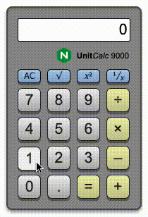

UnitCalc 9000
=============

A demo application that implements a simple desktop calculator to highlight various capabilities of [NGINX Unit](https://unit.nginx.org/).

Application Architecture
------------------------
UnitCalc 9000 is a web application with the following characteristics:

 * HTML/CSS/JavaScript frontend to render a familiar desktop calculator
 * JSON/REST backend API that implements the mathematical operations
 * Each mathematical operation is implemented as a discrete microservice
   - **` + `** Python
   - **` - `** Ruby
   - **` × `** Java
   - **` ÷ `** Node.JS
   - **` √ `** Go
 * NGINX Unit serves the frontend and backend components on a single port, and without any other dependencies
   - Each of the mathematical operations are routed to their respective application code
   - All other requests are routed to the `frontend` directory
 
Installation
------------
**MacOS**

0. Ensure you have [Homebrew](https://brew.sh/) installed
1. Clone this repo and `cd` into it
2. Install the prerequisites (this will also create a Unit configuration for the current directory)
   - `macos-prep.sh`
3. Start NGINX Unit
   - `unitd --control 127.0.0.1:8080`
4. Apply the Unit configuration
   - `curl -X PUT --data-binary @unitconf_local.json http://127.0.0.1:8080/config`

**Docker**

1. Download the [Dockerfile](Dockerfile)
2. Build Docker image
   - `docker build -t unitcalc .`
3. Start the image
   - `docker run --name unitcalc -d -p 9000:9000 unitcalc`

Demonstration
-------------
 * Test backend operation
   - `curl -d '{"operands": [5, 10, 10]}' http://localhost:9000/add`
   - Check [Open API Specification](backend-oas3.yaml) for other backend operations
 * Open browser at [localhost:9000](http://localhost:9000/)
